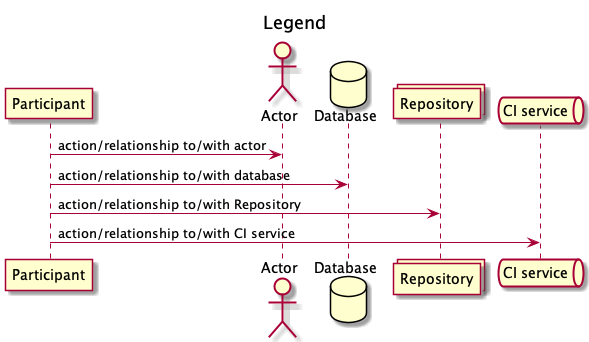
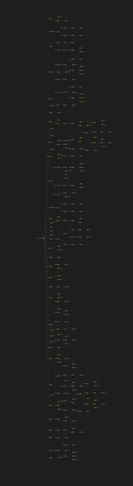
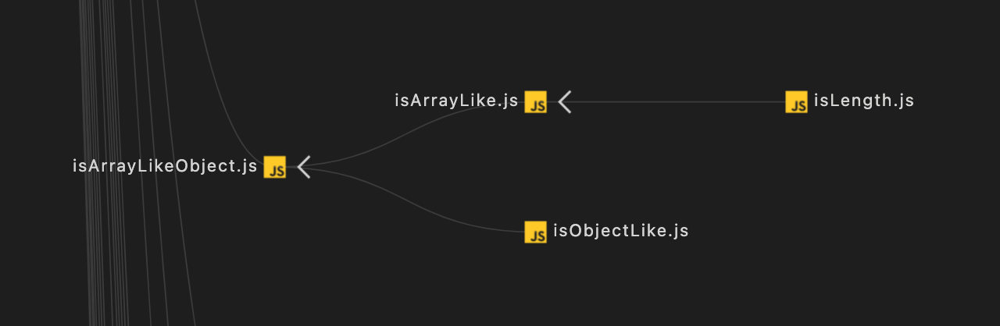

\
\
\
\
\
\
\
\
\
 
# TESTPLAN V1.0<!-- omit in toc -->
## Course ID: COMP.SE.200-2021-2022-1 Software Testing
\
\
\
\
\
\
Diyaz Yakubov H298010
\
\
\
\
 

# Table of contents <!-- omit in toc -->
- [Definitions, acronyms and abbreviations](#definitions-acronyms-and-abbreviations)
- [Introduction](#introduction)
  - [Context](#context)
- [Test environment](#test-environment)
- [Test cases](#test-cases)
  - [Functions to test](#functions-to-test)
  - [What functions do not test](#what-functions-do-not-test)
  - [Test results](#test-results)
  - [Error classification/categorization](#error-classificationcategorization)
  - [Common understanding of term "PASSED"](#common-understanding-of-term-passed)
- [Changelog](#changelog)
- [References](#references)

# Definitions, acronyms and abbreviations
<!-- List of any definitions, acronyms and abbreviations used in the document. -->
* VS Code - [Visual Studio Code](https://code.visualstudio.com/) is a code editor;
* QA - Quality Assurance;
* CI - Continuous Integration;
* WIP - Work in Progress;
* V1.0 - version of the Testplan, Version 1.0.
* ISTQB - International Software Testing Qualification Board. 

# Introduction
This document aims to show how to approach testing of the library in a more efficient and predictive way. The document is made of 5 main sections, which are 
- [Definitions, acronyms and abbreviations](#definitions-acronyms-and-abbreviations) - contains all definitions, acronyms and abbreviations.
- [Introduction](#introduction) - introduction to the document
- [Test environment](#test-environment) - describes tools, packages, libraries, etc. of the environment. It also contains a diagram that shows the relationship between those. Basically, it gives an answer to the question: "Where to test?".
- [Test cases](#test-cases) - this part answers to following questions: "What to test?", "How to test?", "How to evaluate?"
- [References](#references) - contains all cites. 
   
The document is prepared for QA engineers (testers) to give them a good basement to start maintaining and improving the library. It contains a vital minimum of test cases so that a team may ensure that the quality of the library would not deteriorate drastically.  
It is always worth knowing the domain of the library under test. [Context](#context) subsection is highly recommended to read first. 
## Context
The library is meant to be used in a front end application built with React. React promotes functional programming and composition over inheritance.

The application is an E-commerce store selling food products from various small producers. Users can search products by category, price, producer and various other criteria. Products can be added to a shopping cart. Shopping cart automatically updates and shows the total price. Checkout process is handled with a third-party solution.

The food producers can add their products via a previously created portal. The producers can leave some fields blank if they do not want to specify some attributes like category or calories. It has been decided that the store front end is responsible for handling these missing values. Front end is also responsible for making sure that the product descriptions look similar i.e. the first word of a sentence starts with an upper-case letter and that prices are shown with two decimal accuracy.

  

# Test environment
Nowadays, testing tooling is an essential attribute of any modern project. In order to provide a convenient and comprehensive experience, we chose well-known libraries and tools in our company. They cover all team's needs, and the majority of team members are familiar with those tools.
Mocha[[1](#references)] + chai[[2](#references)] are a perfect combination for testing. Mocha is a lightweight testing framework, while chai is an assertion library. Written tests are very declarative, and people may read them as in plain English, which means tests are kind of self documented.  
As far as the project is hosted as open source project on GitHub[[3](#references)], there is a good CI service for that: Travis CI (CI pipeline)[[4](#references)]. First of all, it is free for open source projects. Secondly, it has a broad community, and it is easy to maintain. Last but not least, it has perfect integration with GitHub. Travis CI is utilized for builds and testing.   
Likewise, there is another service Coveralls[[5](#references)], which supports open source projects intensively. It provides some statistics regarding test coverage of the project. The team may track different metrics and ensure that the code is covered properly by test.  
The diagram bellow depicts how all those tools are coherently working. Particularly, it shows `Testing View:Testing sequence` of the library. 

_current.png)  

---

**NOTE**

Draft version of sequence diagram. Probably, it will change after obtaining some travis ci + coverall experience.

--- 

# Test cases
As far as it is a library, and its functionality is quite limited, we assume that glass box testing methods should be enough to ensure the quality of this library. Particularly, unit testing and integration testing should be implemented. In order to be successful and fit in a timeframe, the team should focus on testing the most essential parts of the library.
## Functions to test
In order to maximize test coverage with only 10 source files, the team decided to use analytical approach that complements the decision process. Basically, visualizing dependencies between given functions shows a clear picture of what the most used functions are. If tests cover these 10 essential files, it will mean that N% (will check the number after test coverage measuring) of a code base is tested and 'insured'. Dependency Graph[[6](#references)] and Dependency Cruiser[[7](#references)] VS Code extensions were used as dependency visualizing tools. The results of visualisation are shown bellow. 

Dependency Graph View: whole graph

  

Dependency Graph View: isArrayLikeObject
  

  

Dependency Diagram, Cruiser View

Based on given graphs, the team found out that next functions are met criteria:
- countBy
- ~~difference~~
- ~~get (??? not sure)~~
- ~~keys~~
- reduce
- drop*
- isArrayLikeObject*
- chunk
- toInteger
- isEmpty
- isSymbol
- isArrayLike
- isArgument

`*` - shows that a function and all its dependencies don't have external dependencies, it doesn't have deps from `.internal`  

---
**NOTE**

Company established well-known technique to evaluate and prioritise what to test first, buy this formula:   
`Frequency of usage` x `Severity` = `Priority`, where:
- `Frequency of usage` - how often function is used;
- `Severity` - what is a consequence if something goes wrong;
- `Priority` - tells the importance of function;  
  
However, the team was not able to utilise it, due a shortage of input information. Library is very generic, and the team does not want to do extra work. One way to mitigate this issue is to collaborate with teams who use this library (Mordor team, Foo team) in order to gather more input data. Nevertheless, at current stage statistic code analysis, the team's expertise and exploratory testing are reasonable.

---
## What functions do not test 
Other functions are excluded from test cases because there are not enough resources to test all cases. Probably, they might be covered during evolving of the library. Moreover, the code under `.internal` folder is fully exempted from the testing because it is out of the team's duties (`.internal` is owned by LimPoPo team).  

## Test results
At the current moment, Travis CI's test logs are enough to satisfy team's needs. Logs show detailed information about the CI process where testing is a part of it. Likewise, integration with Coveralls service provides some statistics and basic metrics that might be used for further analysis. Coveralls features might be examined [here](https://coveralls.io/features) [[8](#references)].    

---

**NOTE**

Proposition: testing logs might be extracted and saved separately into database. Feature prove example is [here](https://github.com/final-ci/travis-test-results) [[9](#references)]. Consequently, extracted data might be used for more complex analysis.  
.png)

--- 

## Error classification/categorization
Presently, the team can't use any calculations or analysing methods due to a lack of information. However, the team's expertise and exploratory way of testing provided these four error categories. 
|Category|Description|
|---|---|
|Extensive|this type of error has an impact on the whole system, the system can not handle its primary duties.|
|Significant|this type of error has an impact on module(s), module(s) can not serve its clients or do(es) it incorrectly which causes severe consequences. Nevertheless, the whole system may work.|
|Moderate|this type of error causes inappropriate behavior. Some system features may not work at all, but it doesn't break the main functionality. Moreover, it doesn't result in any drastic malfunctions.|
|Minor|this type of error causes inappropriate behavior. It disturbs the user's experience, but it does not issue any drastic effects. User may cope with it by him/herself.|

## Common understanding of term "PASSED"
In order to cooperate efficiently across teams and team members, the team should agree a common term - "PASSED". To be more concise and do not invent own wheel, the team picked up a well-grained term from ISTQB glossary. Basically, it means ​like following: "If the test's actual result matches its expected result, then a test is ranked to pass." [[10](#references)].  
Additionally, passing tests (quality gates) is an essential part of [Definition Of Done](https://openpracticelibrary.com/practice/definition-of-done/)[[11](#references)] term. 

# Changelog
* 05.10.2021 - denoted critical functions to test.
* 08.10.2021 - testing tools and libs were chosen.

# References
<!-- List of any and all references used in the document. -->
  [1] Mocha official website, https://mochajs.org/;  
  [2] Chai official website, https://www.chaijs.com/;  
  [3] Github official website, https://github.com/;  
  [4] Travis CI official website, https://www.travis-ci.com/;  
  [5] Coveralls official website, https://coveralls.io/;  
  [6] sz-p, (Microsoft)VisualStudio marketplace, https://marketplace.visualstudio.com/items?itemName=sz-p.dependencygraph;  
  [7] Juan Manuel Allo Ron, 2020, open source repository: https://github.com/juanallo/vscode-dependency-cruiser;  
  [8] Coveralls, feature tour page, https://coveralls.io/features;  
  [9] Final-CI organization, Final-CI Community, open source repository: https://github.com/final-ci/travis-test-results;  
  [10] ISTQB (Finnish Software Testing Board), (2015), ISTQB:n testaussanasto v. 2.3 Suomi - Englanti, p.32;  
  [11] Tim Beattie & Matt Takane, 2018, OpenPracticeLibrary web resource: https://openpracticelibrary.com/practice/definition-of-done/;  

  